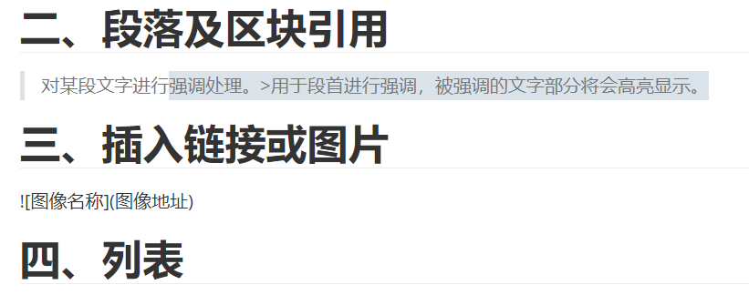

# 一级标题

## 二级标题

# h1
## h2
### h3
#### h4
##### h5
###### h6


> 对某段文字进行强调处理。>用于段首进行强调，被强调的文字部分将会高亮显示。

> 




* 一
  - 二
    - 三

1. 一

___

***

*这里是斜体*
_这里是斜体_

**这里是加粗**
__这里是加粗__

| 表头 | 条目 |
| ---- | ---- |
|      |      |

```java
public static void main(String[] args){
    System.out.println("这是java代码块");
}
```

```python
public static void main(String[] args){
    System.out.println("这是java代码块");
}
```

```html

```

$$
X^{23}+N_{23}
$$


$$
\frac{23}{45}+{123}\over{456}+\sqrt{45}
$$


