# 一、TensorRT简介

TensorRT：

- 用于高效实现已训练好的深度学习模型的推理过程的SDK。
- 内含推理优化器和运行时环境。
- 使DL模型能以更高吞吐量和更低的延迟运行。
- 有C++和Python的API，完全等价可以混用。

链接：

https://docs.nvidia.com/deeplearning/tensorrt/developer-guide/index.html (TensorRT文档)

https://docs.nvidia.com/deeplearning/tensorrt/api/c_api (C++ API文档)

https://docs.nvidia.com/deeplearning/tensorrt/api/python_api (python API文档)

https://developer.nvidia.com/nvidia-tensorrt-download (TensorRT下载)

https://github.com/NVIDIA/trt-samples-for-hackathon-cn/tree/master/cookbook (代码)

# 二、TensorRT安装

## 2.1 下载

1. **下载地址：https://developer.nvidia.com/nvidia-tensorrt-download**

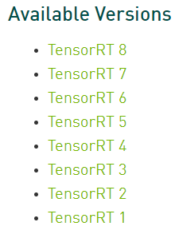

可以根据需要选择版本。

2. **具有多个小版本**

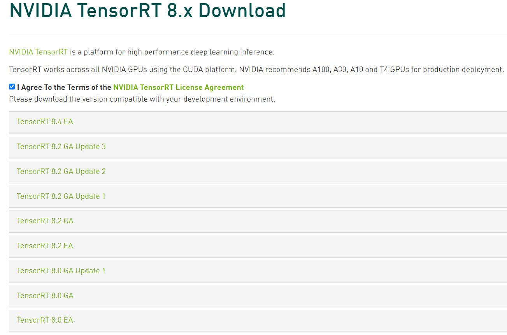

> EA version stands for early access (It is before actual release).
>
> GA stands for general availability. GA is stable version and completely tested.

点击某一个版本后，可以看到各种平台的安装包，这里要注意两点

- 平台
- CUDA版本（可以通过nvcc --version查看）

## 2.2 Windows版本安装方法

1. 下载正确版本，并解压。
2. 将文件包下的lib添加到系统环境变量中。
3. 分别安装文件包下python、graphsurgeon、onnx_graphsurgeon和uff目录下的whl文件。
   - python.exe -m pip install xxx.whl
   - python文件的下安装文件，要选择正确的python版本。

> onnx用于pytorch，uff用于tensorflow

## 2.3 验证是否安装成功

```python
import tensorrt as trt
print(trt.__version__)
```

## 2.4 运行mnist示例

1. 首先需要安装Visual Studio，并且安装项中选择下图的包，否则可能出现找不到头文件的错误。

   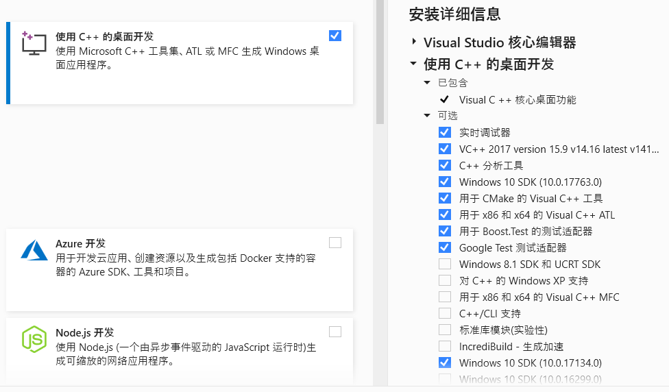

2. 利用VS打开`TensorRT-7.2.3.4\samples\sampleMNIST\sample_mnist.sln`

3. 点击视图，选择`属性管理器`（有可能在其他窗口里面）

4. 点击下图选中项，我们需要配置VC++目录下的`可执行文件目录、包含目录和库目录`，以及链接器/输入下的`附加依赖项`

   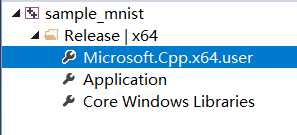

5. 可执行文件目录和包含目录需要添加`TensorRT-7.2.3.4\include`，库目录需要添加`TensorET-7.2.3.4\lib`

6. 链接器/输入/附加依赖项中需要添加`TensorRT-7.2.3.4\lib`下的lib文件名称

   ```
   myelin64_1.lib
   nvinfer.lib
   nvinfer_plugin.lib
   nvonnxparser.lib
   nvparsers.lib
   ```

   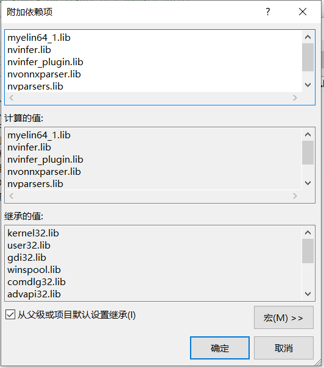

7. 至此，所有配置工作完成。下面我们将窗口切换为`解决方案管理器`，生成解决方案。

   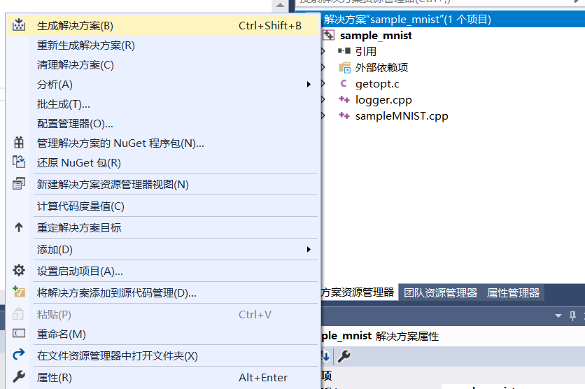

8. 生成成功后，显示如下图。

   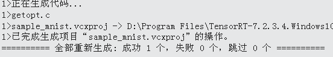

9. 进入`TensorRT-7.2.3.4\data\mnist`下查看是否由测试数据，没有时执行`python download_pgms.py`

   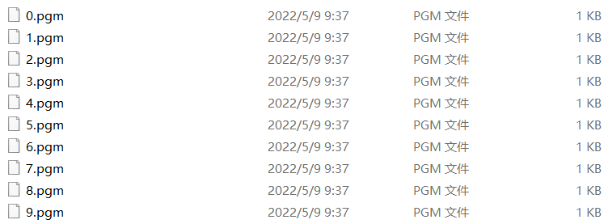

10. 报下图错误时，只要正常下载好测试数据了，就不需要管它。

    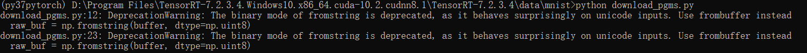

11. 之后点击`本地Windows调试器`开始运行。

    

12. 正确的结果：

    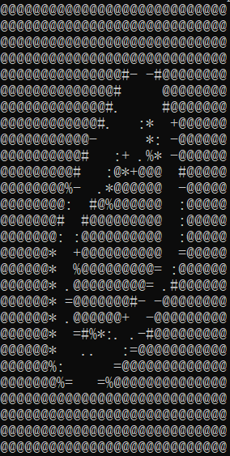

    


# 三、TensorRT的使用方案

## 3.1 基本方案

如果我们需要利用TensorRT加速模型，那么前提我们要告诉tensorrt，模型是什么样子的，权重是什么等等。

TensorRT为我们提供了一些API，通过这些API我们可以将现有模型的层结构信息，转为TensorRT的结构。

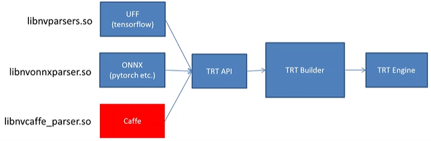

> 针对不同的深度学习框架，TensorRT提供不同的解决方案。
>
> 1. 利用TensorRT提供的通用解释器，将UFF/ONNX/Caffe转为TensorRT格式文件。例如：pytorch中我们需要将pth格式的模型权值文件转为onnx格式。之后利用onnx解释器转为TensorRT格式文件。**上面图中的流程就是这种方式。**
> 2. 不过，有些网络中的layer，TensorRT官方解释器可能还没有支持，这时候就需要自己动手实现（自定义插件）。[onnx-tensorrt/operators.md at main · onnx/onnx-tensorrt · GitHub](https://github.com/onnx/onnx-tensorrt/blob/main/docs/operators.md)这个网址是已经支持的layer。
> 3. 还有一种使用方案就是完全自己动手实现，不借助官方解释器。

## 3.2 ONNX

TensorRT 从框架中导入训练模型的主要方式是通过 [ONNX](https://onnx.ai/) 交换格式。TensorRT 附带一个 ONNX 解析器库来帮助导入模型。

**如何导出ONNX？**

```python
unet = UNet()
unet.eval()
path = "./model_save/unet_best.pth"
onnxFile='./model_onnx/unet_best.onnx'
unet.load_state_dict(torch.load(path,map_location='cpu'))  # 加载模型可学习参数
input=torch.randn(1,2,128,128)#构造的输入
output=unet(input)
# 导出onnx的函数
torch.onnx.export(unet,input,onnxFile,input_names=['input'],output_names=['output'],opset_version=9)
ort_session=onnxruntime.InferenceSession(onnxFile)
ort_inputs={ort_session.get_inputs()[0].name:input.detach().numpy()}
ort_outs=ort_session.run(None,ort_inputs)
# np.testing.assert_allclose(output.detach().numpy(),ort_outs[0],rtol=1e-3,atol=1e-5) #检验onnx模型和pt模型的输出是否相同
```

## 3.3 TensorRT加速流程

### 3.3.1 步骤

Build engine：

- 创建Builder

- 创建Network
- 创建Parser
- 绑定输入、输出以及自定义组件
- 序列化或者反序列化

inference：

- 传输计算数据（host—>device）
- 执行计算
- 传输计算结果（device—>host）

Plugin：当现有解释器没有实现要使用的算子时，就需要自己实现。

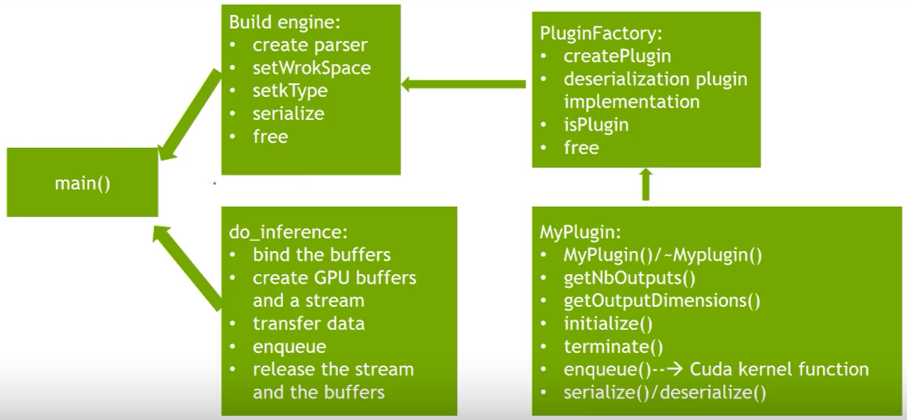


### 3.3.2 生成.engine文件

这里我们利用onnx文件创建TensorRT engine文件。

Python API 可以通过以下模块访问：tensorrt。不过不是所有的TensorRT版本都支持Python API，截止到20220509，目前8.2及以上版本支持Python API。

**1. 创建Builder**

要创建一个builder，首先创建一个Logger。

```python
logger = trt.Logger(trt.Logger.WARNING)
```

或者，定义自己的记录器实现：ILogger

```python
class MyLogger(trt.ILogger):
    def __init__(self):
       trt.ILogger.__init__(self)

    def log(self, severity, msg):
        pass # Your custom logging implementation here

logger = MyLogger()
```

然后，创建builder：

```python
builder = trt.Builder(logger)
```

**2. 创建Network**

```python
network = builder.create_network(1 << int(trt.NetworkDefinitionCreationFlag.EXPLICIT_BATCH))
```

TensorRT 支持两种指定网络的模式：显式批处理和隐式批处理。

在**隐式批处理**模式下，每个张量都有一个隐式批处理维度，所有其他维度必须具有恒定长度。此模式由 TensoRT 的早期版本使用，现在已弃用，但继续支持以实现向后兼容性。

在**显式批处理**模式下，所有维度都是显式的并且**可以是动态的**，即它们的长度可以在执行时改变。许多新功能（例如动态形状和循环）仅在此模式下可用。ONNX 解析器也需要它。

例如，考虑一个处理 NCHW 格式的具有 3 个通道的大小为 HxW 的 N 个图像的网络。在运行时，输入张量的维度为 [N,3,H,W]。这两种模式的不同之处在于网络定义指定张量的维度：

- 在显式批处理模式下，网络指定 [N,3,H,W]。
- 在隐式批处理模式下，网络仅指定 [3,H,W]。批次维度 N 是隐式的。

> 在固定batch时，batch的大小由我们生成onnx时，输入张量决定的`input=torch.randn(5,2,128,128)`
>
> 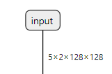
>
> 如果我们的onnx的batch为1，在TensorRT中，即使输入batch>1也只会得到一个有效推理结果。
>
> 因此在固定batch时，想要多batch推理，就需要修改onnx生成时的输入张量的batch。

**3.使用 ONNX 解析器导入模型**

```python
parser = trt.OnnxParser(network, logger)
然后，读取模型文件并处理任何错误：
success = parser.parse_from_file(onnx_file_path)
if not success:
    raise RuntimeError(f'failed to load ONNX file: {onnx_file_path}')
```

**4. 构建engine**

下一步是创建一个builder配置，指定 TensorRT 应该如何优化模型：

```python
config = builder.create_builder_config()
```

这个接口有很多属性，你可以设置这些属性来控制 TensorRT 如何优化网络。**一个重要的属性是最大工作空间大小**。layer实现通常需要一个临时工作空间，并且此参数限制了网络中任何层可以使用的最大大小。如果提供的工作空间不足，TensorRT 可能无法找到layer的实现：

```python
config.set_memory_pool_limit(trt.MemoryPoolType.WORKSPACE, 1 << 20) # 1 MiB
或
config.max_workspace_size = 1 << 20
```

指定配置后，可以使用以下命令构建和序列化引擎：

```python
serialized_engine = builder.build_serialized_network(network, config)
或
engine = builder.build_engine(network, config)
engine.serialize()
```

将引擎保存到文件以供将来使用：

```python
with open(“sample.engine”, “wb”) as f:
    f.write(serialized_engine)
```

**注意：**序列化引擎不能跨平台或 TensorRT 版本移植。引擎特定于它们构建的确切 GPU 模型。

**5. 全部代码**

```python
import tensorrt as trt

def build_engine(onnx_file_path,engine_file_path,half=False):
    """Takes an ONNX file and creates a TensorRT engine to run inference with"""
    logger = trt.Logger(trt.Logger.INFO)
    builder = trt.Builder(logger)
    flag = (1 << int(trt.NetworkDefinitionCreationFlag.EXPLICIT_BATCH))
    network = builder.create_network(flag)
    parser = trt.OnnxParser(network, logger)
    if not parser.parse_from_file(str(onnx_file_path)):
        raise RuntimeError(f'failed to load ONNX file: {onnx_file_path}')
    config = builder.create_builder_config()
    config.max_workspace_size = 4 * 1 << 30
    half &= builder.platform_has_fast_fp16
    if half:
        config.set_flag(trt.BuilderFlag.FP16)
    engine = builder.build_engine(network, config)
    with open(engine_file_path, 'wb') as t:
        t.write(engine.serialize())
    return engine_file_path
```

### 3.3.3 反序列化和执行推理

**1. 反序列化**

要执行推理，首先需要使用Runtime接口。与构建器一样，Runtime需要记录器的实例。

```python
runtime = trt.Runtime(logger)
```

然后，从内存缓冲区反序列化引擎：

```python
engine = runtime.deserialize_cuda_engine(serialized_engine)
```

如果需要从文件加载引擎，请运行：

```python
with open(“sample.engine”, “rb”) as f:
    serialized_engine = f.read()
engine = runtime.deserialize_cuda_engine(serialized_engine)
```

**2. 执行推理**

引擎在拥有待优化的模型后，还需要额外的中间激活状态，才可以执行推理。这是通过IExecutionContext接口得到的：

```python
context = engine.create_execution_context()
```

一个引擎可以有多个执行上下文，允许一组权重用于多个重叠的推理任务。（一个例外是使用动态shape时，每个优化配置文件只能有一个执行上下文。）

要执行推理，必须为输入和输出传递 TensorRT 缓冲区，TensorRT 要求在 GPU 指针列表中指定。为每个输入和输出设置 GPU 缓冲区。然后，创建一个 GPU 指针列表。

```python
input_ptr = cuda.mem_alloc(1 * image.size * image.dtype.itemsize)
output_ptr = cuda.mem_alloc(1 * output.size * output.dtype.itemsize)
buffers[int(input_ptr),int(output_ptr)]
```

填充输入缓冲区后，您可以调用 TensorRT 的执行异步使用 CUDA 流异步启动推理的方法。

首先，创建 CUDA 流。如果您已经有 CUDA 流，则可以使用指向现有流的指针。

```python
stream = cuda.Stream()
```

接下来，开始推理：

```python
context.execute_async_v2(buffers, stream_ptr)
```

异步入队是很常见的内存（）在内核之前和之后从 GPU 移动数据（如果它还没有的话）。

确定内核（以及可能内存（）) 完成后，使用标准的 CUDA 同步机制，例如事件或等待流。例如，对于 Polygraphy，使用：

```python
stream.synchronize()
```

如果您更喜欢同步推理，请使用`execute_v2`方法而不是`execute_async_v2`。

**3. 全部代码**

```python
image = np.stack(imgs1[i:(i + 1)])
image = image.astype(np.float32)
image = image.ravel()  # 数据平铺
outshape = context.get_binding_shape(1) # (1,2,128,128)
output = np.empty((outshape), dtype=np.float32)
d_input = cuda.mem_alloc(1 * image.size * image.dtype.itemsize)
d_output = cuda.mem_alloc(1 * output.size * output.dtype.itemsize)
bindings = [int(d_input), int(d_output)]
stream = cuda.Stream()

cuda.memcpy_htod(d_input, image)
context.execute_v2(bindings)
cuda.memcpy_dtoh(output, d_output)
output = output.reshape(outshape)
output = torch.nn.Softmax(dim=1)(torch.tensor(output)).numpy()
all_output = np.concatenate((all_output, output))
```


## 3.2 开发辅助工具

### 3.2.1 trtexec

TensorRT命令行工具，主要的End2End性能测试工具

### 3.2.2 Netron

模型网络可视化工具

下载地址：https://github.com/lutzroeder/Netron

查看网络结构、查看计算图信息、查看节点信息

### 3.2.3 onnx-graphsurgeon

onnx计算图编辑工具

### 3.2.4 polygraphy

结果验证与定位，图优化

### 3.2.5 Nsight Systems

性能分析

# 常见错误

1. FileNotFoundError: Could not find: cublas64_11.dll. Is it on your PATH?

   TensorRT版本与CUDA版本不匹配。由cublas64_**11**名字可知，安装的TensorRT版本用于CUDA11.x。

2. AttributeError: 'tensorrt.tensorrt.Builder' object has no attribute 'max_workspace_size'
3. 
