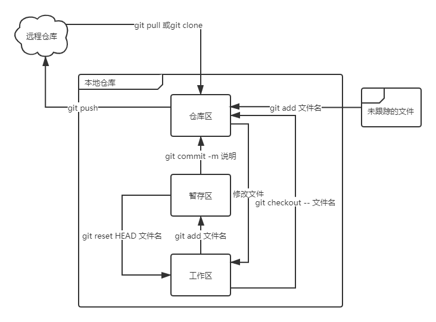
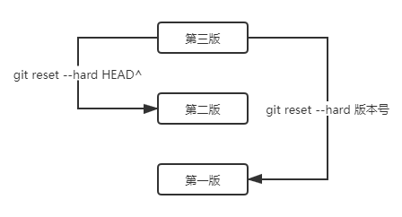

### 一、Github基本概念

1. 仓库（Repository）：仓库用来存放项目代码，每一个项目对应一个仓库，多个开源项目则有多个仓库；
2. 收藏（Star）：收藏项目，方便下次查看；
3. 复制克隆项目（Fork）：完整地把别人的项目复制到自己的github上；
4. 发起请求（Pull Request）：基于Fork，如果别人在你的基础上做了改进，后来决定改进不错，应该让更多的人受益，于是就可以发起一个Pull Request请求合并的原项目中，之后等待你的审核，你觉得ok，那么他做的改进就合并到你的项目中了；
5. 关注（Watch）
6. Issues：发现代码BUG，但是目前没有成型代码，需要讨论时使用；或者开源项目出现问题时使用。

### 二、git命令

1. 查看系统config：git config --system --list
2. 查看用户config：git config --global --list
3. 设置用户名和邮箱：git config --global user.name "名字"、git config --global user.email "邮箱"
4. 在当前目录新建一个代码库：git init
5. 克隆远程项目：git clone [url] 

### 三、git一些概念

1. Workspace:工作区，平时放代码的地方。
2. Index/stage:暂存区，用于临时存放代码的改动，实际上它只是一个文件，保存即将提交的文件列表信息。
3. Repositoty:仓库区，安全存放数据的位置，里面包含提交的所有版本数据，其中HEAD指向最新版本。
4. Remote:远程仓库，托管代码的服务器。



### 四、git文件操作

文件的4种状态:

- Untracked:未跟踪，此文件在文件夹中，但并没有加入到git仓库，不参与版本控制，通过git add状态变为Staged。
- Unmodify:文件已经入库，未修改，即版本库中的文件快照内容与文件夹中的一致，这种文件有两种去处。
  - 1、被修改变成Modified.
  - 2、使用 git rm 移除版本库，变成Untracked.
- Modified:文件已经修改，仅仅是修改未进行其他操作，这种文件有两种去处。
  - 1、使用git add 可进入暂存staged状态。
  - 2、使用git checkout -- 文件名,丢弃修改过的，返回Unmodify状态。
- Staged:暂存状态，执行git commit,将修改同步到本地库中，这时本地库中的文件与本地文件一致，文件为Unmodify状态。执行git reset HEAD filename取消暂存，文件变为Modified。

git status [filename]#查看文件状态
git status #查看所有文件状态

### 五、git版本控制

1. git log：查看版本列表；
2. 在Git中，用`HEAD`表示当前版本，上一个版本就是`HEAD^`，上上一个版本就是`HEAD^^`。
3. git reset --hard HEAD^
4. git reset --hard 版本号
5. 回到未来版本，只要找到该版本的版本号就可以回去
   - 在回退到过去版本后还没有关闭命令行的情况下，可以顺着命令行往上找到版本号；
   - 在关闭命令行或清除屏幕后，使用git reflog找到操作记录，在记录中找到版本号。



### 六、删除文件

通常直接在文件管理器中把没用的文件删了，或者用`rm`命令删了：

```
$ rm test.txt
```

这个时候，Git知道你删除了文件，因此，工作区和版本库就不一致了。

现在你有两个选择，一是确实要从版本库中删除该文件，那就用命令`git rm`删掉，并且`git commit`：

```
$ git rm test.txt
rm 'test.txt'

$ git commit -m "remove test.txt"
[master d46f35e] remove test.txt
 1 file changed, 1 deletion(-)
 delete mode 100644 test.txt
```

现在，文件就从版本库中被删除了。

另一种情况是删错了，因为版本库里还有呢，所以可以很轻松地把误删的文件恢复到最新版本：

```
$ git checkout -- test.txt
```

`git checkout`其实是用版本库里的版本替换工作区的版本，无论工作区是修改还是删除，都可以“一键还原”。

 注意：从来没有被添加到版本库就被删除的文件，是无法恢复的！

### 七、忽略文件

不提交到仓库中的文件。
springboot中可以在.gitignore中配置忽略文件。
规则:

- *.txt : 忽略所有的txt文件。
- ！lib.txt : 但是这个文件除外。
- /temp : 仅忽略
- build/ : 忽略build目录下的所有文件。