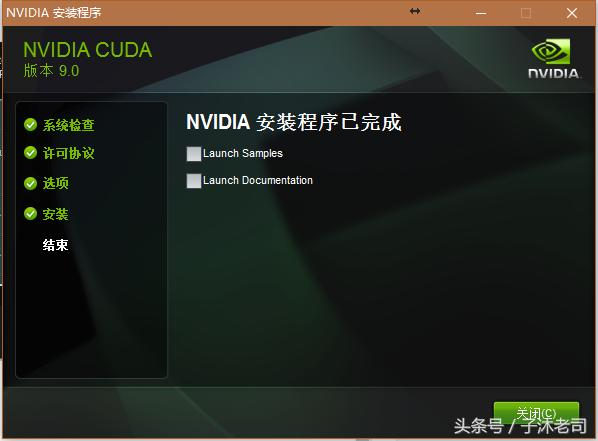

tensorflow-gpu版本的安装相对来说复杂一些，因为需要考虑版本匹配的一些问题，很容易出问题，不过和前面安装cpu版本的过程基本一致， 我用了几个小时的时间最终安装成功，下面和大家分享一下我的安装过程。

**安装环境**

操作系统：64位win10

GPU：NVIDIA GeForce MX150


# 安装TensorFlow-GPU版

命令：conda install tensorflow-gpu

# 检查GPU是否支持CUDN

- 一般如果做深度学习，最好安装GPU类型，因为运算速度更快

- 首先需要查看自己电脑的GPU型号，然后用谷歌搜索“你的GPU型号+SPECIFICATION”，在官网查它是否支持CUDA

# 下载并安装CUDA

下载网址：https://developer.nvidia.com/cuda-downloads

推荐下载：https://developer.nvidia.com/cuda-10.0-download-archive


将上一步下载好的安装包，按照提示按照即可。


选择 ok

等进度条走完，就会进入安装界面。


安装加载界面


检查系统兼容性，等一下就好

如果检测通过了，那么恭喜你，你的显卡可以安装cuda，如果没有通过，只能抱歉的告诉你，只能请你pip unistall tensorflow-gpu，然后执行pip install tensorflow。那你的电脑的显卡不支持tensorflow-gpu加速。


点击 同意并继续

如果你不知道你要安装些什么，那么请你勾选，精简。如果


勾选精简，然后点击下一步


等待安装完成


选择 下一步



全部勾选 ，点击关闭

一般情况下：CUDA环境已经自动配置好了。

# 安装cuDNN

对于tensorflow而言，真正实现加速的是cudnn，然后cudnn调用的是cuda显卡驱动。所以最后我们要配置cudnn这个模块。

cuDNN的全称为NVIDIA CUDA® Deep Neural Network library，是NVIDIA专门针对深度神经网络（Deep Neural Networks）中的基础操作而设计基于GPU的加速库。cuDNN为深度神经网络中的标准流程提供了高度优化的实现方式，例如convolution、pooling、normalization以及activation layers的前向以及后向过程。

cuDNN只是NVIDIA深度神经网络软件开发包中的其中一种加速库。想了解NVIDIA深度神经网络加速库中的其他包请戳链接https://developer.nvidia.com/deep-learning-software。

下面我们说一下正确的安装cuDNN方式，其实跟着官方安装说明进行安装就可以了。

1. 从https://developer.nvidia.com/cudnn上下载cudnn相应版本的压缩包（可能需要注册或登录）。
2. 如果这个压缩包不是.tgz格式的，把这个压缩包重命名为.tgz格式。解压当前的.tgz格式的软件包到系统中的任意路径，解压后的文件夹名为cuda，文件夹中包含三个文件夹：一个为include，另一个为lib，还有一个是bin，然后复制到CUDA_PATH下面。
3. 将解压后的文件中的lib/x64文件夹关联到环境变量中。这一步很重要。（配置到环境变量的path全局变量里，详细过程这里就不演示了）


复制目录的位置

#测试是否安装成功

在ANACONDA窗口的tensorflow的环境中，跑一个test.py，看是否能运行成功。

如下图，得到了“Hello World”证明一切安装顺利。


test.py的内容如下

```text
import tensorflow as tf
# Create TensorFlow object called tensor
hello_constant = tf.constant('Hello World!')

with tf.Session() as sess:
    # Run the tf.constant operation in the session
    output = sess.run(hello_constant)
    print(output.decode())# bytestring decode to string.
```

上述test.py代码只是检测了tensorflow是否安装成功。

如果想要**检测tensorflow的确用gpu来做运算**了，请用以下脚本测试

```text
import tensorflow as tf
# Creates a graph.
a = tf.constant([1.0, 2.0, 3.0, 4.0, 5.0, 6.0], shape=[2, 3], name='a')
b = tf.constant([1.0, 2.0, 3.0, 4.0, 5.0, 6.0], shape=[3, 2], name='b')
c = tf.matmul(a, b)
# Creates a session with log_device_placement set to True.
sess = tf.Session(config=tf.ConfigProto(log_device_placement=True))
# Runs the op.
print(sess.run(c))
```

测试结果如下图


图中device:GPU:0的意思就是说该运算用到了GPU。

注意：如果你的电脑有一个独立显卡，那么它的名字为 gpu:0（而不是gpu:1，与任务管理器中的不同），你的CPU里面其实还有一个集成显卡，它的名字也是gpu:0。你使用GPU的时候，默认就是独立显卡。使用CPU时，是集成显卡。

```
"/cpu:0"：机器的 CPU。
"/device:GPU:0"：机器的 GPU（如果有一个）。
"/device:GPU:1"：机器的第二个 GPU（以此类推）。
```

```python
from tensorflow.python.client import device_lib
print(device_lib.list_local_devices())
```


上面的代码可以查看Tensorflow可用设备的信息


# tensorflow使用指定gpu的方法

如果机器中有多块GPU，tensorflow会默认吃掉所有能用的显存， 如果实验室多人公用一台服务器，希望指定使用特定某块GPU。（其实个人电脑，就一块独立gpu）

可以在文件开头加入如下代码：

```
import os
os.environ["CUDA_DEVICE_ORDER"]="PCI_BUS_ID"
os.environ["CUDA_VISIBLE_DEVICES"] ="0"# 使用第二块GPU（从0开始）
```


也可以指定使用某几块GPU

```
import os
os.environ["CUDA_DEVICE_ORDER"]="PCI_BUS_ID"
os.environ["CUDA_VISIBLE_DEVICES"] ="0, 2"# 使用第一, 三块GPU
```

禁用GPU

```
import os
os.environ["CUDA_VISIBLE_DEVICES"] ="-1"
```

#TensorFlow CPU/GPU互换

```python
with tf.Session() as ses:
    with tf.device("/gpu:1"):
        matrix1=tf.constant([[3.,3.]])
        matrix2=tf.constant([[2.],[2.]])
        product=tf.matmul(matrix1,matrix2)
#方法二： 
import tensorflow as tf
sess = tf.Session(config=tf.ConfigProto(device_count={'gpu':0}))
#方法三：使用CUDA_VISIBLE_DEVICES命令行参数，代码如下
import os
os.environ["CUDA_DEVICE_ORDER"]="PCI_BUS_ID"
os.environ["CUDA_VISIBLE_DEVICES"] ="0"# 使用第二块GPU（从0开始）
```

注意：gpu同一时间只能由一个程序占用，因此在切换训练模型时，先关闭服务，在开启新的。


tensorflow2.0 使用**tf.config.list_physical_devices('GPU')**判断

# 安装tensorflow2.x + CUDA 10.x+cuDAA 10.x 版本后无法使用GPU


解决方法：

进入**C:\Program Files\NVIDIA GPU Computing Toolkit\CUDA\v10.0\bin**目录下，修改无法找到文件的名称为xxx_10。(原来为xxx_100)